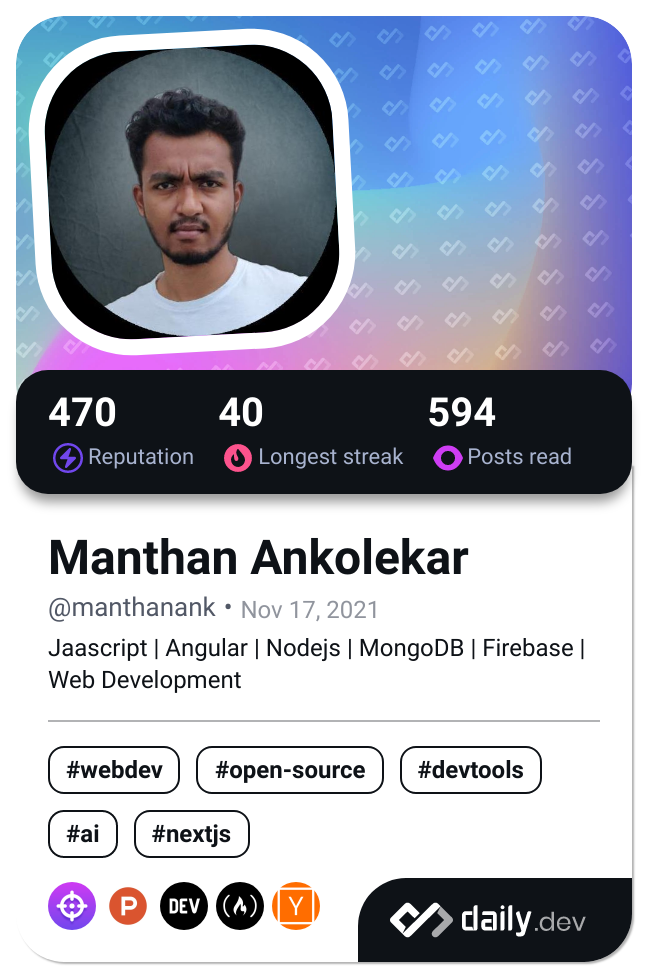

# Daily.dev DevCard

## About

This repository automatically updates my [daily.dev](https://daily.dev) DevCard every day using GitHub Actions. The DevCard showcases my reading activity, favorite publications, and developer profile rank on daily.dev.

## How it works

- **Automatic Updates**: The DevCard is updated daily at midnight UTC using a scheduled GitHub Action
- **Manual Trigger**: The workflow can also be triggered manually from the Actions tab
- **Live DevCard**: Click on the card above to view my live profile on daily.dev

## Setup Your Own DevCard

Want to add a DevCard to your GitHub profile? Follow these steps:

1. **Generate your DevCard**: Visit [daily.dev DevCard generator](https://app.daily.dev/devcard)
2. **Get your User ID**: Copy the ID from your DevCard URL (the part before `.png`)
3. **Set up the GitHub Action**: Use the workflow in `.github/workflows/main.yml`
4. **Add your User ID**: Set `USER_ID` as a repository secret in Settings > Secrets
5. **Update README**: Reference the generated `devcard.png` file

## Features

- ✅ Automatic daily updates
- ✅ Manual workflow dispatch
- ✅ Dependabot for action updates
- ✅ Responsive DevCard display
- ✅ Direct link to daily.dev profile

## Tech Stack

- **GitHub Actions**: For automation
- **daily.dev API**: For DevCard generation
- **Jekyll**: For GitHub Pages (optional)

---

*This project follows the latest [daily.dev DevCard guide](https://daily.dev/blog/adding-the-daily-devcard-to-your-github-profile) and best practices.*
